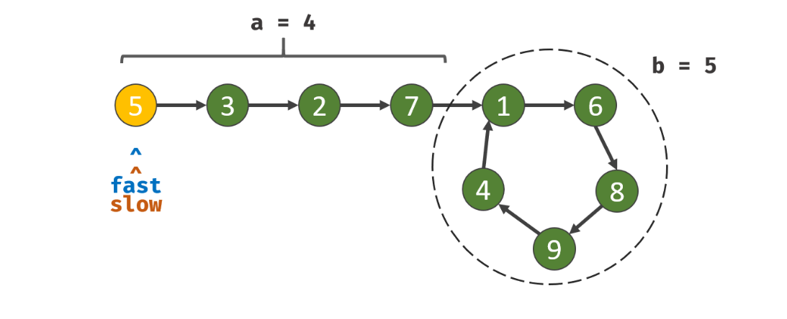

# Solution(Python)

1. Traverse linked list using two pointers.

2. Move one pointer(slow) by one and another pointer(fast) by two.

3. If these pointers meet at the same node then there is a loop. If pointers do not meet then linked list doesn’t have a loop.

4. When they meet in the circle, use another pointer starts from the head, and this pointer moves one step with the slow pointer, when they meet, this node is the entry.

- `a` is defined as the distance between the head point and the entry point.
- `b` is defined as the length of the circle.
- `f` is defined as the fast pointer moved distance.
- `s` is defined as the slow pointer moved distance.
- `k` is defined as the distance between head node and entry node.
 `f = 2 * s`, `f = s + n * b `, so we can get `s = n * b`, as `k = a + n * b`, so the slow pointer moves `a` steps can reach entry node.

