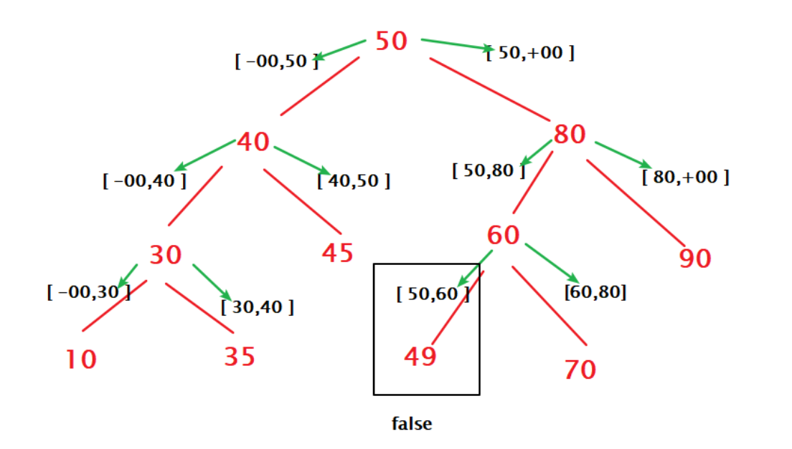

# Solution(Python)

## Recursive Traversal with Valid Range

1. The value of the current node is the upper bound (maximum value) of the value of its left subtree.

2. The value of the current node is the lower bound (minimum value) of the value of its right subtree.

3. Recursive on the left and right subtrees respectively.

## Recursive Inorder Traversal

1. Compute inorder traversal list.

2. Check if each element in inorder is smaller than the next one.

## Iterative Inorder Traversal

Use stack instead.