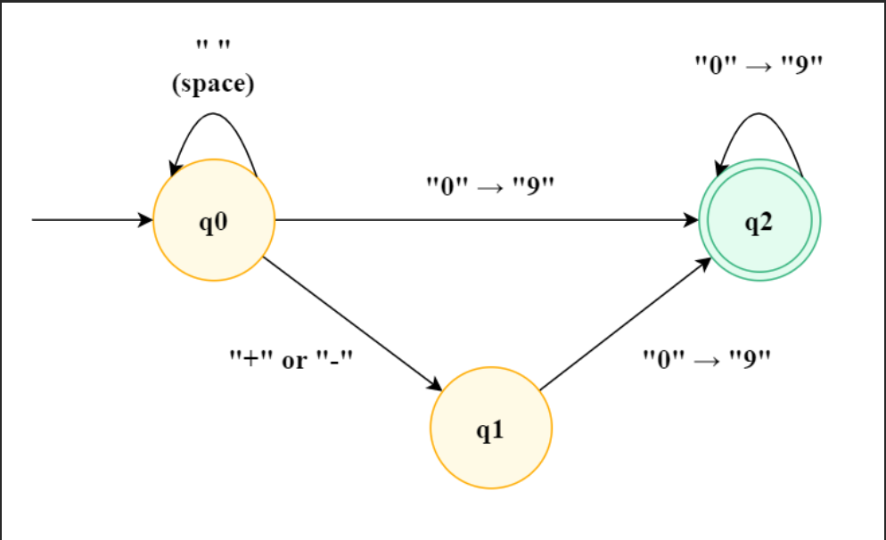

# Solution(Python)

## Solution1 TC(O(N)) SC(O(1))

1. Remove leading spaces

2. If a symbolic character appears, only the 1st one is valid and the positive and negative are recorded.

3. Converting subsequent occurrences of numeric characters.

## DFA(Deterministic finite automaton) TC(O(N)) SC(O(1))

